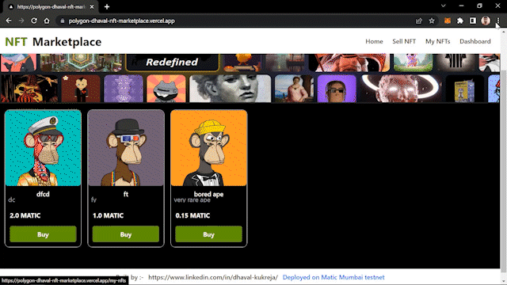
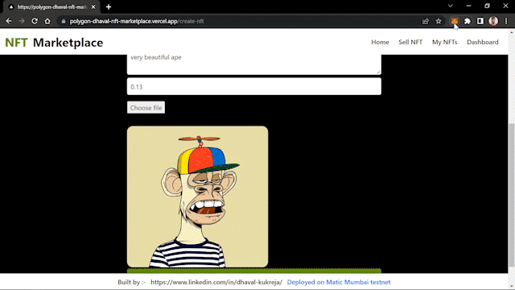
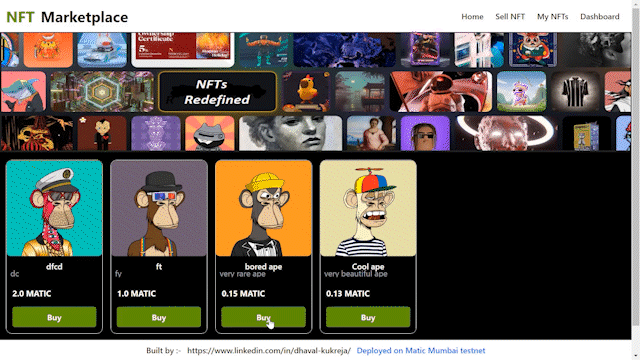
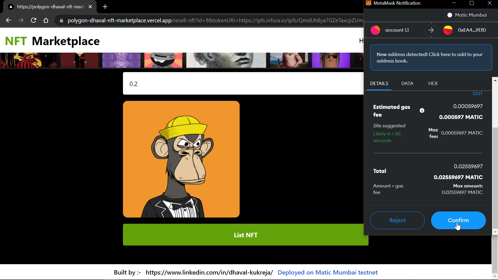
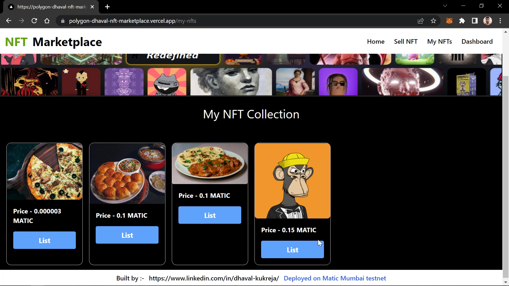
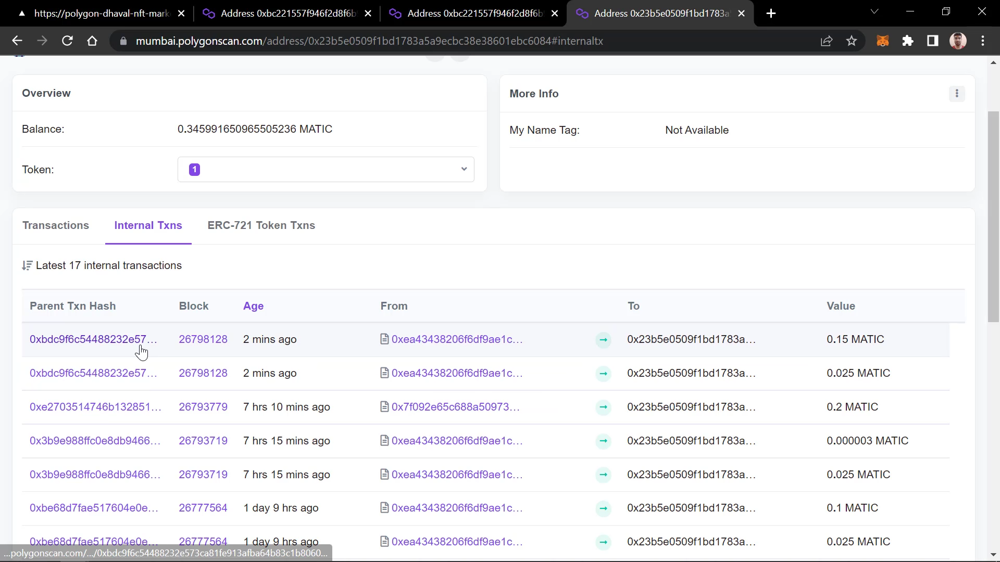

# **Energy-marketplace-polygon**  
## 🔗https://polygon-dhaval-nft-marketplace.vercel.app/

A full stack NFT marketplace built on Ethereum using Solidity, IPFS, Next.js, Ethers.js, Hardhat and then deploying it on Ploygon testnet network

> The marketplace has been deployed on Matic Mumbai testne and can be accessed on the given link🔗 : **https://polygon-dhaval-nft-marketplace.vercel.app/**
>

## The app can perform the following functions : 

## 1. Mint your digital assest as a NFT

## 1.1                        

## 1.2

## 2. Buying NFTs
## 2.1                        

## 2.2                        

## 3. Reselling/listing your NFTs

## 3. View all your NFTs

> ## NOTE : 
> *All the transactions can be verified at https://mumbai.polygonscan.com/*
> 
